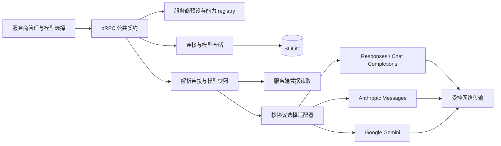

# Daily Signal：模型与服务商管理方案

状态：第一阶段已实现，等待真实服务和浏览器视觉验收。当前代码包含多连接持久化、旧配置迁移、四类协议适配、受控网络、模型管理、默认选择、生成快照和真实 API 页面。

[打开交互原型](provider-preview.html)。原型仍用于对照视觉方向，数据只保留在页面内存。产品页面已经接入 oRPC 与 SQLite；模型 ID 仍不代表最新目录或可用性承诺。

## 产品方向

把现在的一个 Base URL + 一个模型输入框，升级为一个可靠的个人模型连接管理器。一次配置后，下次打开直接使用；切换模型时看清调用哪家服务、哪套连接、哪个模型。

- 借鉴 [cc-switch](https://github.com/farion1231/cc-switch) 的服务商预设、自定义连接、启用切换与配置管理体验。
- 借鉴 [sub2api](https://github.com/Wei-Shaw/sub2api) 的多上游组织和路由思路；日报应用通过其网关 API 接入现有账号池。sub2api 本身还管理账户、认证、计费、并发与请求转发，这些平台职责不属于首期日报功能。
- 品牌资源统一采用 [Lobe Icons](https://github.com/lobehub/lobe-icons)。设计参考不意味着复制两个项目的代码或承诺全部功能对等。

明确区分三个概念：

| 概念 | 例子 | 保存在哪里 |
| --- | --- | --- |
| 服务商预设 | OpenAI、DeepSeek、Anthropic、百炼、自定义网关 | 版本化的代码 registry，提供品牌、默认地址和可选协议 |
| 连接 | “DeepSeek · 个人”“OpenAI · 工作”“我的 sub2api” | SQLite，每条拥有独立名称、地址、协议、凭据与参数 |
| 模型 | 某条连接下的准确 model ID，以及可选显示名和能力 | SQLite，关联具体连接 |

同一个品牌允许多条连接；同一个模型 ID 可以出现在不同连接。协议独立于品牌，例如网关暴露 Anthropic Messages 时，不能仅因它提供 Claude 就使用 OpenAI Chat Completions。

## 信息架构与交互

设置入口从“AI 设置”调整为“模型与服务商”。沿用纸白背景、暖灰边框、陶土色强调和衬线标题；表单使用无衬线字体，模型 ID 和地址使用等宽字体。品牌色只出现在图标，避免整屏混用品牌主色。

桌面页面由三部分构成：

1. 顶部显示当前默认模型、所属连接与配置状态。修改默认模型是明确操作，与保存连接分开。
2. 左侧约 260px 的连接列表：搜索、品牌图标、连接名、模型数量、默认标记。列表不会只用颜色表达状态。
3. 右侧配置区包含“连接配置”和“可用模型”两个页签。配置页的基本字段包含名称、地址、协议、凭据；超时与各协议思考参数放进高级设置。自定义请求头尚未实现。

移动端采用连接列表 → 配置详情，详情路由为 `/settings/providers/:id`，保留返回入口和明确的保存按钮；桌面同时展示列表与详情。表单离开保护覆盖应用内路由、浏览器返回与页面关闭。

**添加流程：** 点击添加 → 选择服务商预设 → 自动填入地址与协议 → 输入 Key → 保存连接。当前版本只测试已保存的连接，不支持保存前草稿测试；测试失败或暂时离线不会阻止保存。切换预设和关闭对话框会清理 Key 草稿。

**配置保存：** 保存整个连接，包括 Key 的新增、保留或显式移除。未提交的草稿在离开时确认；请求失败保留草稿。revision 冲突会拒绝覆盖后台或其他页面已经保存的新配置。

**模型管理：** 提供“获取模型”与“手动添加”。服务商不支持查询、权限不足或网络失败，都不会清空已保存的模型。查询结果是可用 ID 的候选来源，不保证每个模型都有调用权限；上下文窗口、视觉、思考等能力只有在有依据时才显示，未知值明确标记未知。

**默认模型：** 搜索结果按照连接分组，显示模型名称、准确 ID 与连接名。切换只影响下一次生成。禁用或删除默认连接时，必须先选择替代项，或明确清空默认并回到未配置状态；禁止静默切到另一家服务商。

**连接测试：** 分阶段显示地址可达、认证结果、实际模型调用结果，并记录检查时间和请求耗时。若接口不能独立验证认证，显示未单独验证，不能虚构通过。失败定位到地址、凭据、模型权限、限额或超时。编辑地址、凭据、协议、模型后，旧测试记录标记过期。测试发生真实模型调用前明确提示可能产生少量费用。

今日简报的生成区域增加模型选择器：`模型名 / 连接名`。设置页负责管理，日常切换无需反复进入设置。首期只设置一个“日报默认模型”，暂不分别配置提取与合成模型，减少混合调用与计费理解成本。

## 协议与覆盖范围

“支持”必须同时具备：可配置、可保存、可测试、可生成、错误可理解。仅有品牌图标或预设不算完成支持。

| 阶段 | 支持目标 | 接入方式与边界 |
| --- | --- | --- |
| 第一阶段 | OpenAI 官方 | Responses 与 Chat Completions 显式区分；迁移旧连接时保留 Chat Completions |
| 第一阶段 | Anthropic、Google Gemini | 原生 Messages / Gemini 适配器；各自处理认证头、路径和输出限制 |
| 第一阶段 | DeepSeek | OpenAI-compatible 加独立思考参数映射；延续现有默认关闭策略 |
| 第一阶段 | 百炼、Moonshot、智谱、硅基流动、OpenRouter | 已提供预设地址、图标与 OpenAI Chat Completions 兼容适配；地区/Coding Plan 独立预设尚未实现 |
| 第一阶段 | 自定义网关、已部署的 sub2api | 地址 + API Key + 实际对外协议；支持网关提供的模型 ID |
| 第二阶段 | Ollama、LM Studio | 独立的本地连接类型；明确本机地址、端口、是否需要认证；保留公开网络连接的原有边界 |
| 第二阶段 | 更多厂商与 MiniMax 等专用端点 | 按实际协议和模型参数增加适配，不凭品牌名猜测；同厂商不同端点可用不同预设 |
| 第三阶段 | 可直接授权的订阅/OAuth 账户 | 独立认证模块，包含授权回调、状态校验、token 更新与撤销；只开放已验证的服务 |
| 后续按需 | Azure OpenAI、Bedrock、Vertex AI | 具有部署名、地区或云身份字段的专用适配器，不能伪装成一个通用 Key 表单 |

用户已有的订阅账户可以先经现成 sub2api 网关接入。直接登录订阅账号涉及独立的协议和认证适配，不能把网页 Cookie 或 CLI token 填进 API Key 后就宣称支持。

## 实现结构



沿用项目现有 React、Tailwind v4、Radix、TanStack Query、Jotai、oRPC、Zod、Drizzle 和 SQLite。继续使用 AI SDK，原生协议通过对应 provider 包适配。日报业务只接收统一的 `LanguageModel`，不再在生成逻辑里按 hostname 判断厂商参数。

当前模块划分：

```text
shared/providers/catalog.ts       品牌、预设、协议与非敏感默认值
shared/providers/schemas.ts       输入、公共响应、模型能力、测试结果
server/modules/providers/repository.ts  连接、模型、凭据持久化与默认选择事务
server/modules/providers/adapters.ts    按协议构造模型与映射参数
server/modules/providers/discovery.ts   模型目录查询与格式归一
server/modules/providers/transport.ts   基于 infrastructure/network/public-fetch.ts 的受控传输
src/components/SettingsView.tsx   连接列表、详情、模型列表、添加对话框
src/components/ProviderIcon.tsx   Lobe 品牌映射与缺失图标回退
```

后端按入口、业务模块与基础设施组织，测试与对应实现放在同一目录：

```text
server/
  index.ts                         HTTP 启动与退出
  migrate.ts                       数据库迁移命令入口
  http/                            Express 应用、本地同源保护、Vite/静态文件托管
  rpc/                             契约绑定、错误映射、分业务接口与并发互斥
  core/                            共用业务错误
  infrastructure/database/         SQLite 连接、schema、迁移与首次启动初始化
  infrastructure/network/          公开网络校验、DNS/重定向/超时与大小限制
  modules/feeds/                   RSS/OPML 解析、抓取入库、订阅和文章查询
  modules/ai/                      连接测试、日报生成与持久化
  modules/providers/               服务商配置、凭据、模型发现与协议适配
  modules/settings/                默认模板、设置读取与保存
  modules/state/                   聚合各模块的公开应用状态
```

`rpc/router.ts` 只组合接口，不直接操作数据库。数据库客户端仅导出 `db` / `sqlite`；业务查询放在对应模块，`state/service.ts` 负责聚合。RSS/OPML 解析不访问数据库或网络。共享契约仍放在 `shared/`，前端不依赖后端实现。

后端统一使用 Prettier（单引号、100 列、尾逗号），配置位于 `server/.prettierrc.json`。`pnpm format:server` 格式化后端；`pnpm check` 依次检查后端格式、Oxlint、类型及递归发现的后端测试。`pnpm build` 和 `pnpm db:migrate` 的入口命令保持不变。

registry 只提供默认值，升级预设时不覆盖用户保存的 URL、模型或参数。模型 ID 始终是可输入的字符串；静态目录仅提供建议，不能成为拒绝新模型的枚举。

公共接口为 `providers.list/create/update/remove`、`providers.test/discoverModels`、`providerModels.save/remove` 和 `defaultModel.set`。生成入口只引用数据库中的 `providerModelId`，不从浏览器重复提交整套配置或密钥。旧 settings 接口继续由仓储层桥接，避免模板或 Key 更新破坏原生协议配置。

协议适配器统一负责构造模型、可选的模型发现、参数映射和能力验证。地址规范化按协议处理，不能通用地补 `/v1`，也不能根据模型 ID 的前缀推断请求协议。DeepSeek 思考、OpenAI reasoning、Anthropic thinking、Gemini thinking 采用分别验证的 schema；“未知能力”不应自动启用参数。

## 数据模型与持久化

| 表/配置 | 关键字段 | 约束 |
| --- | --- | --- |
| `providers` | id、presetId、name、protocol、baseUrl、enabled、options、revision、createdAt、updatedAt | 多连接；revision 用于检测并发修改；options 按协议验证 |
| `provider_credentials` | providerId、apiKey、updatedAt | 仅服务端读取，一条连接一份凭据；不进入公共 settings JSON |
| `provider_models` | id、providerId、modelId、displayName、enabled、capabilities、options、source | 唯一约束 `(providerId, modelId)`；source 标记手动/查询/预设 |
| 应用设置 | defaultProviderModelId、template | 默认模型外键引用；更新与删除在事务中维护一致性 |
| `provider_checks` | providerId、modelId、configRevision、stage、status、latencyMs、checkedAt、safeError | 测试结果绑定配置版本，避免把过期结果显示为当前健康状态 |

数据库是唯一持久化来源。React 本地状态只保存未提交草稿；客户端只接收无密钥的公共响应。

API Key 默认入库。公共响应只返回 `hasCredential` 等状态，密码框不回填已保存明文。更新 API 中省略代表保留，显式移除代表删除，新值代表替换。修改地址或协议后，旧凭据不能自动流向新目标。当前不支持自定义请求头。

当前 `provider_credentials.api_key` 仍为 SQLite 明文列，与旧单连接的安全边界相同；这不是静态加密。后续若采用 AES-GCM，必须把可靠根密钥放在独立本地文件或部署密钥中，并定义数据库与根密钥的共同备份、迁移和恢复流程。在这些条件齐备前，不用和密文同库的“加密”营造错误安全感。

生成开始时解析并冻结连接、模型、参数和模板快照，途中修改默认模型不会影响正在生成的任务。归档保存 provider 名称、model ID、协议及参数摘要，不保存凭据；删除连接后历史日报仍能正常阅读。

第二阶段再增加 `generation_runs`：记录 provider/model 快照、阶段、耗时、输入/输出/推理 token、状态。费用只能按有来源的费率估算，并显示估算标记；没有费率时显示未知，不能把未知当作免费。

## 网络与可靠性

所有原生 SDK 都经过现有受控 fetch，保留公开地址验证、DNS 检查、响应大小与可配置超时限制，并把实际请求限制在已配置 HTTPS origin。模型发现同样走受控 GET，限制为 30 秒、512 KiB 和最多 500 个候选；它禁止重定向，避免认证头或 Gemini Key 被带到其他 origin。当前只读取单页目录，不实现分页。

本地模型单独定义 `local` 网络策略，限制到明确配置的本机 origin 和端口，不接受把该地址重定向到其他目标。不能为支持 Ollama 而放宽 RSS 或所有自定义 URL 的网络限制。

故障转移第三阶段才开放，默认关闭。用户明确指定候选连接、优先级、额外费用和可发送数据的范围。只对适合重试的临时错误切换，不对认证、格式、上下文限制盲目重试。一次日报不能静默混用不同服务商；若跨 provider 重试整个任务，需记录尝试过程并控制总调用预算，避免重复计费被隐藏。

## Lobe 图标规范

已从 `@lobehub/icons-static-svg@1.95.0` 选取 SVG，保留 MIT 声明，放在 `docs/assets/providers/`。`ProviderIcon` 通过静态白名单导入生产构建；图标不会按用户输入动态拼接远程 URL，也不会运行时从 CDN 拉取。Lobe 官方提供 React 与静态 SVG 等使用方式。[图标资源说明](assets/providers/README.md)

| 对象 | 服务商图标 | 模型图标 |
| --- | --- | --- |
| OpenAI / GPT | `openai.svg` | OpenAI |
| Anthropic / Claude | `anthropic.svg` | `claude-color.svg` |
| Google / Gemini | `gemini-color.svg` | Gemini |
| DeepSeek | `deepseek-color.svg` | DeepSeek |
| 百炼 / Qwen | `bailian-color.svg` | `qwen-color.svg` |
| Moonshot / Kimi | `moonshot.svg` | `kimi-color.svg` |
| 智谱 / Z.ai | 地区对应 `zhipu-color.svg` 或 `zai.svg` | 依据显式模型品牌元数据 |
| MiniMax | `minimax-color.svg` | MiniMax |
| OpenRouter、硅基流动 | 对应平台图标 | 可显示已识别的模型厂商品牌，未知则使用平台图标 |
| Ollama、LM Studio | 对应本地服务图标 | 依据模型元数据 |
| 自定义网关 / sub2api | 通用网关图标或用户选择的内置图标 | 与模型品牌独立 |

常规列表图标为 24px，详情图标为 28–32px，背景容器为 40–48px。保留 SVG 比例；单色图标适配当前前景色，彩色图标保持品牌色。旁边已有文字时图标 `alt=""`，仅图标的按钮必须有 accessible name。

## 实现状态与后续阶段

**已完成的第一阶段：** Tailwind 响应式管理页；OpenAI Responses、OpenAI Chat Completions、Anthropic Messages、Gemini native 四类适配；十个 registry 预设；连接与模型 CRUD；独立 Key；模型发现和手动添加；连接/模型启停；明确默认选择；生成时冻结配置；归档展示历史连接名、协议和模型。旧库升级、新库初始化与删除全部连接后的重启行为均有自动化覆盖。

**第二阶段，扩展接入与可观察性：** Ollama/LM Studio、更多预设、调用用量、配置导入导出。cc-switch 导入应基于用户选择的配置文件与版本化解析，先预览映射结果再保存；不读取整个用户主目录，不覆盖已有连接。导出默认去除凭据。

**第三阶段，高级账户和路由：** 已验证服务的直接 OAuth、token 刷新/撤销、显式备用连接与失败重试策略。此阶段才讨论接近网关的路由能力。

第一阶段的自动化验收覆盖：

1. 旧单连接只迁移一次，原地址、模型、模板、思考设置与已保存 Key 保持可用；原先只在页面内存的 Key 无法自动恢复。
2. 同一品牌创建两条连接，刷新页面和重启服务后都还在，且彼此 Key 不串用。
3. Responses、Chat Completions、Messages、Gemini 的路径、认证和参数构造均通过 mock 受控传输测试；真实服务端点仍待有授权凭据的环境验收。
4. `/models` 不存在或返回无权限时，手动添加仍可用，已有模型列表不丢失。
5. 默认模型切换只影响下一次生成；处理中修改或删除连接不会改变本次快照。
6. API、日志、浏览器存储、归档和默认导出里均不出现 Key；保存模型/模板不能误删凭据。
7. 未配置、未测试、测试通过、检查过期、认证失败、限额不足、停用都有明确状态，且不只靠颜色表达。
8. 页面 populated/empty、详情与 404 路径已通过 React SSR smoke check。375px、768px、1024px、1440px 的浏览器布局、键盘路径、焦点回退和视觉细节仍待人工验收。

## 原型维护与当前验证边界

原型本身使用 Tailwind utilities。重新生成独立样式：

```sh
pnpm dlx @tailwindcss/cli@4.3.3 -i docs/provider-preview.css -o docs/assets/provider-preview.css --minify
```

应用的 Tailwind 扫描范围限定在 `src`，原型不会增加生产 CSS 的候选类。

当前验证边界：没有读取用户秘密，也没有向真实付费服务发起调用；四类协议使用 mock 受控传输验证。当前环境没有可用浏览器，因此没有截图或真实视觉/键盘验收。OAuth、Ollama/LM Studio、本地网络策略、自动故障转移、用量与账单、配置导入导出、自定义请求头、地区/Coding Plan 预设和保存前草稿测试都没有在第一阶段实现。
